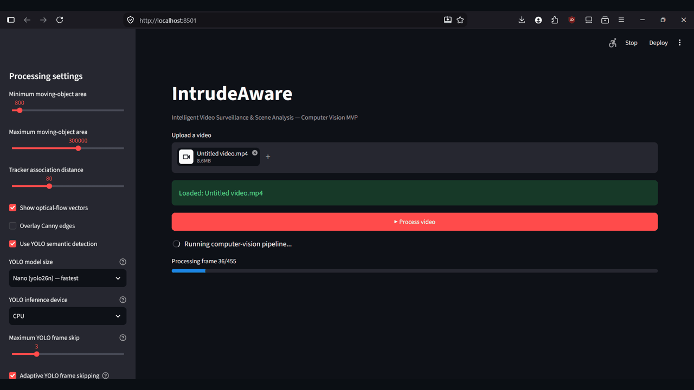
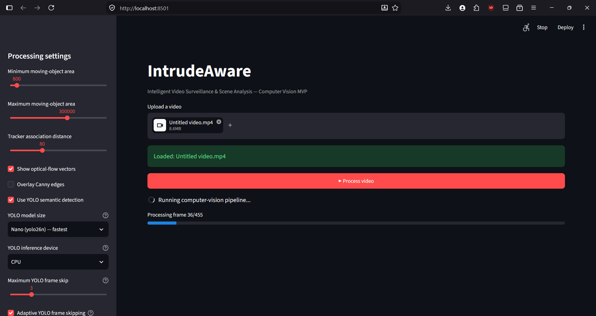
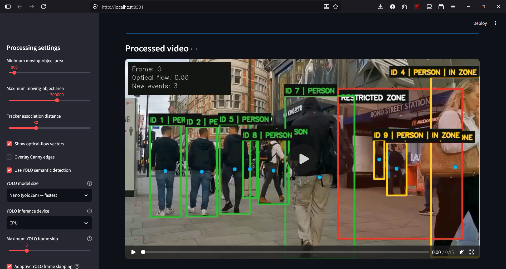
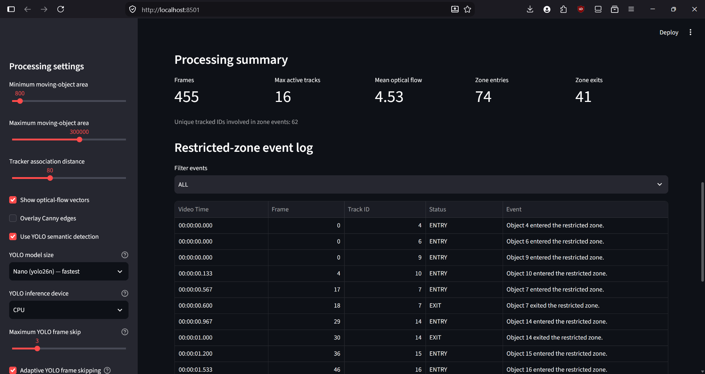
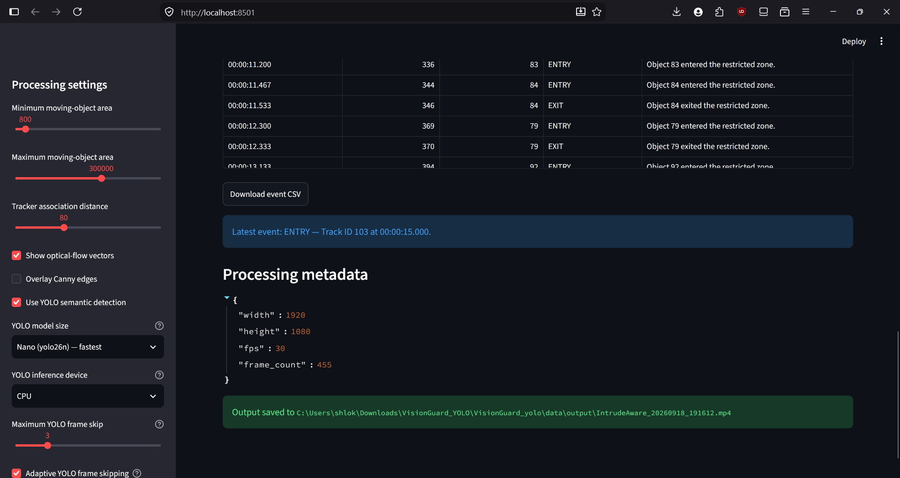
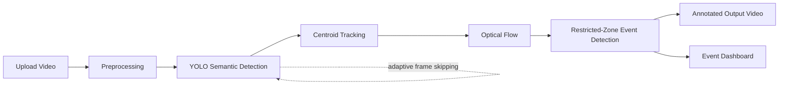

# IntrudeAware — Intelligent Video Surveillance & Scene Analysis

IntrudeAware is a Computer Vision Project for CSE3010. It processes an uploaded video, performs image preprocessing, foreground/motion-based object detection, centroid tracking, optical-flow analysis, and rule-based restricted-zone event detection, then produces an annotated output video and basic analytics.

## CSE3010 alignment

This project demonstrates concepts appearing in the course syllabus, including preprocessing/filtering, histogram enhancement, edge detection, background subtraction, optical flow, object detection/tracking, and motion analysis. The course also lists object detection/tracking and optical-flow experiments among its indicative practical work.

## Features

1. **Image preprocessing**
   - Resize
   - Gaussian filtering
   - CLAHE contrast enhancement
   - Canny edge detection
2. **Motion/object detection**
   - MOG2 background subtraction
   - Morphological cleanup
   - Contour-based moving-object detection
3. **Object tracking**
   - Nearest-centroid association
   - Persistent track IDs
   - Track trails
4. **Motion analysis**
   - Sparse Lucas–Kanade optical flow
   - Mean motion magnitude
5. **Semantic labeling**
   - PERSON detection with OpenCV HOG
   - CAR/BIKE/VEHICLE labels using transparent geometry/extent cues
   - Labels persist through centroid tracks
6. **Event analysis**
   - Restricted-zone intrusion detection
   - Event log and counts
7. **Visualization**
   - Bounding boxes with `ID | LABEL`
   - `IN ZONE` status for active tracks
   - Motion vectors
   - Region of interest
   - Analytics dashboard


## Visual Demo

The following animated preview shows the main IntrudeAware workflow: configuration, processed-video overlay, restricted-zone event analytics, and processing metadata.



### Interface and results

| Application interface | Processed video overlay |
|---|---|
|  |  |

| Restricted-zone event log | Processing metadata |
|---|---|
|  |  |

## System Workflow



## Demo Configuration

The demonstrated run uses the Streamlit controls shown in the screenshots:

- YOLO semantic detection: enabled
- YOLO model: `yolo26n` (Nano)
- Inference device: CPU
- Maximum YOLO frame skip: `3`
- Adaptive YOLO frame skipping: enabled
- Optical-flow vectors: enabled
- Tracker association distance: `80`

The processed example contains 455 frames at 30 FPS and reports track-level restricted-zone events with timestamps, frame numbers, track IDs, and `ENTRY`/`EXIT` status.

## Project structure

```text
IntrudeAware/
├── app.py
├── requirements.txt
├── README.md
├── statement.md
├── LICENSE
├── .gitignore
├── config/
│   ├── __init__.py
│   └── config.py
├── preprocessing/
│   ├── __init__.py
│   ├── image_preprocessing.py
│   ├── enhancement.py
│   └── edge_detection.py
├── detection/
│   ├── __init__.py
│   ├── object_detector.py
│   └── semantic_labeler.py
├── tracking/
│   ├── __init__.py
│   └── tracker.py
├── motion/
│   ├── __init__.py
│   ├── background_subtraction.py
│   └── optical_flow.py
├── analysis/
│   ├── __init__.py
│   ├── event_detection.py
│   └── statistics.py
├── visualization/
│   ├── __init__.py
│   ├── drawing.py
│   └── charts.py
├── utils/
│   ├── __init__.py
│   ├── video_utils.py
│   └── logger.py
├── report/
│   ├── diagrams
│   ├── evidence
│   ├── figures
│   ├── IntrudeAware_Final_Report.tex
│   ├── references.bib
│   └── README_Latex.md
├── tests/
│   ├── test_preprocessing.py
│   ├── test_tracking.py
│   └── test_motion.py
├── models/
│   └── .gitkeep
├── data/
│   ├── input/
│   │   └── .gitkeep
│   └── output/
│       └── .gitkeep
└── docs/
    ├── architecture.md
    └── workflow.md
```

## Installation

Python 3.10+ is recommended.

```bash
python -m venv .venv
```

Windows PowerShell:

```powershell
.\.venv\Scripts\Activate.ps1
```

Linux/macOS:

```bash
source .venv/bin/activate
```

Install dependencies:

```bash
pip install -r requirements.txt
```

## Run

From the project root:

```bash
streamlit run app.py
```

Upload an MP4/AVI/MOV/MKV video, choose the processing settings, and click **Process video**.

The processed video is saved under `data/output/` and displayed in the dashboard.

## Tests

```bash
pytest -q
```

## Important note

The core detector intentionally uses classical computer vision: foreground extraction + contours. Semantic labels are added with OpenCV HOG for people and simple, explainable geometry/extent heuristics for other moving blobs. These CAR/BIKE labels are approximate rather than learned predictions. A future version can replace `detection/semantic_labeler.py` with a trained detector such as a YOLO-family model without changing the tracking, event, or visualization layers.

## Suggested next milestones

- Add camera calibration and perspective correction.
- Add a line-crossing counter.
- Add stronger multi-object tracking.
- Add a learned object detector as an optional backend.
- Add CSV/JSON export and persistent event storage.
- Add a formal evaluation dataset and precision/recall/F1 measurements.

## Restricted-Zone Event Dashboard

IntrudeAware records restricted-zone state transitions for tracked objects. The dashboard reports video-relative timestamps, frame numbers, track IDs, and `ENTRY`/`EXIT` status. A short tracking gap does not create a duplicate entry event for an object that remains inside the zone.

## YOLO Semantic Detection

The semantic-label stage now uses a pretrained Ultralytics YOLO detector instead of the previous HOG/shape heuristics. IntrudeAware converts YOLO detections into the existing `Detection` objects, so the existing centroid tracker, restricted-zone event engine, dashboard, and video overlay remain unchanged.

The default model is `yolo26n.pt`. On the first YOLO-enabled run, Ultralytics downloads the pretrained weight file automatically if it is not already available locally. The sidebar exposes a confidence threshold so false positives can be traded against missed detections.

Supported overlay mappings currently include `PERSON`, `BIKE` (bicycle or motorcycle), `CAR`, `BUS`, and `TRUCK`. Other model classes are ignored by the IntrudeAware application layer.


## YOLO frame skipping

The sidebar includes a YOLO frame-skip control. A value of `1` runs semantic detection on every frame; higher values run YOLO less frequently. Between YOLO inference frames, the existing centroid tracker extrapolates the active tracks using their recent motion history. This keeps persistent track IDs, semantic labels, restricted-zone event processing, and the video overlay updating on every intermediate frame without running YOLO on every frame.


## YOLO controls

The Streamlit sidebar lets you choose the pretrained YOLO26 detection scale (`n`, `s`, `m`, `l`, or `x`) and inference device. CPU is always available; CUDA is offered only when PyTorch reports a CUDA-capable GPU. The selected device is passed to Ultralytics through the standard `device` inference argument.

Adaptive YOLO frame skipping is available from the Streamlit sidebar. The scheduler uses an exponentially weighted moving average (EWMA) of tracked-object velocity to reduce sensitivity to noisy frame-to-frame motion. A short YOLO refresh cooldown imposes a minimum gap between adaptive refreshes, preventing rapid interval oscillation while preserving faster refreshes during meaningful motion or zone activity.


## Adaptive YOLO scheduling

IntrudeAware can treat the sidebar frame-skip value as a **maximum** interval instead of a fixed cadence. With adaptive scheduling enabled:

- calm scenes use the configured maximum interval;
- moderate track motion reduces the interval to 2 frames;
- fast track motion runs YOLO every frame;
- any active track inside the restricted zone runs YOLO every frame;
- on intermediate frames, the existing tracker predicts track positions; if a prediction crosses into the restricted zone, IntrudeAware can trigger an immediate YOLO refresh on that same frame.

The existing tracker, restricted-zone event detector, dashboard, and video overlay APIs are unchanged.

## Author

**[Name: Shlok Khanna]** 
**[Reg. No.: 24BAI10235]** \
VITyarthi Project for CSE3010 — Computer Vision  
[VIT Bhopal University]

GitHub: [@shlokrt](https://github.com/shlokrt)
